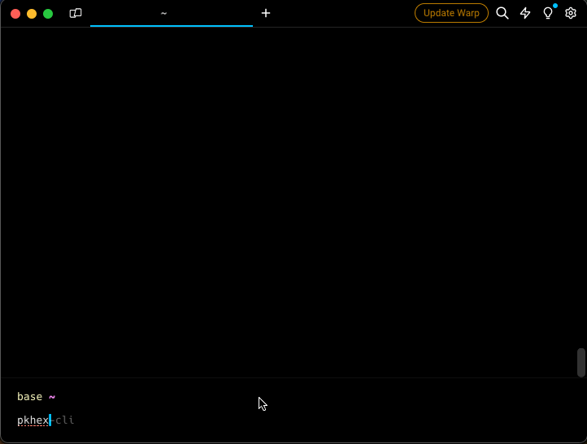

# PKHeX Everywhere

This repository offers 2 different ways of accessing PKHex features in any operating system: a web-based version and a terminal-based version compiled to all major operating systems (macOS, Linux and Windows).

## Supported games
PKHeX.Web and the CLI open every save [PKHeX](https://github.com/kwsch/PKHeX) supports, from Red and Blue to Scarlet and Violet.

PKHeX.Web also opens saves from these ROM hacks:
- Pokémon Unbound
- Pokémon Radical Red
- Emerald Imperium
- Pokémon Emerald Legacy

ROM hack support is experimental. Keep a backup of your save.

## PKHeX.Web
The PKHeX Web version ([pkhex-web.github.io](https://pkhex-web.github.io)) provides a user-friendly interface accessible via any web browser.


This version allows you to manage your party, pokemon box, items, and custom actions through plug-ins, like auto-legality mode, helpers for nuzlocking or live running your save file in a browser-based emulator fully integrated with the app. To learn more check the [wiki](https://github.com/arleypadua/PKHeX.Everywhere/wiki).

The app is a React app ([src/PKHeX.Web.React](./src/PKHeX.Web.React)) over a .NET WebAssembly engine ([src/PKHeX.Everywhere.Engine.Host](./src/PKHeX.Everywhere.Engine.Host)). Run `npm run dev` in `src/PKHeX.Web.React` to start it locally, and `npm run build` to write the site to `dist`.

## npm packages
The engine that powers PKHeX.Web is published to npm, so you can build your own browser tools on PKHeX. Read the [documentation](https://docs.pkhex-everywhere.fyi):

- [`@pkhex-everywhere/engine`](./src/PKHeX.Everywhere.Engine.Sdk/packages/engine/README.md): load, read, edit and export saves in the browser.
- [`@pkhex-everywhere/react`](./src/PKHeX.Everywhere.Engine.Sdk/packages/react/README.md): React hooks for the engine.
- [`@pkhex-everywhere/plugin-sdk`](./src/PKHeX.Everywhere.Engine.Sdk/packages/plugin-sdk/README.md): types for plug-in page modules.

## PKHeX.CLI
The PKHeX Command Line Interface (CLI) version allows users to interact with PKHeX via the terminal. It provides a streamlined way to use PKHeX features directly from the command line.



### Installation Methods:
1. **Curl Script**:
   ```sh
   curl -sL https://raw.githubusercontent.com/arleypadua/PKHeX.Everywhere/main/install.sh | sudo bash
   ```
2. **Homebrew**:
   ```sh
   brew tap arleypadua/homebrew-pkhex-cli
   brew install pkhex-cli
   ```
3. For more information, refer to the documentation [here](./src/PKHeX.CLI).

## License

GPL-3.0-or-later, matching [PKHeX.Core](https://github.com/kwsch/PKHeX), which this project links against. Code contributed before this change was released under MIT; see git history.
